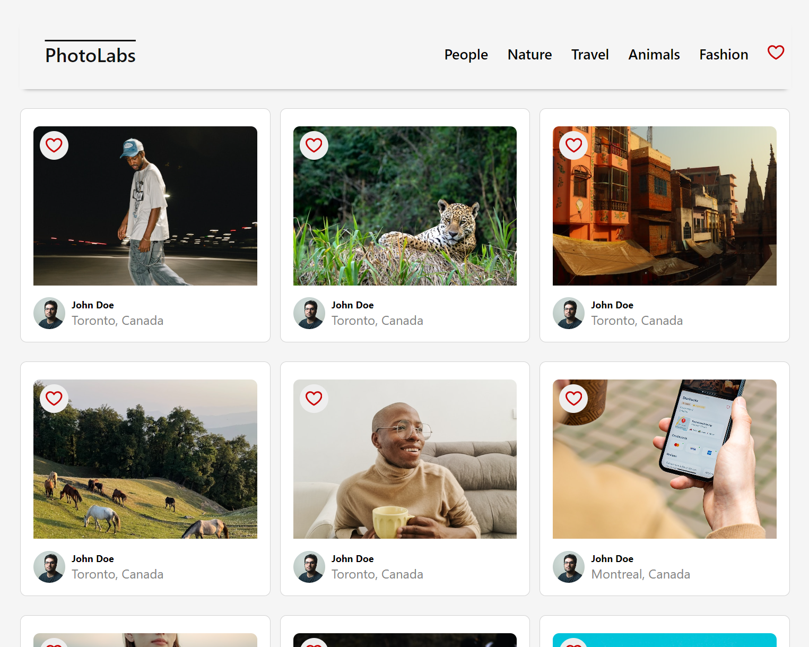
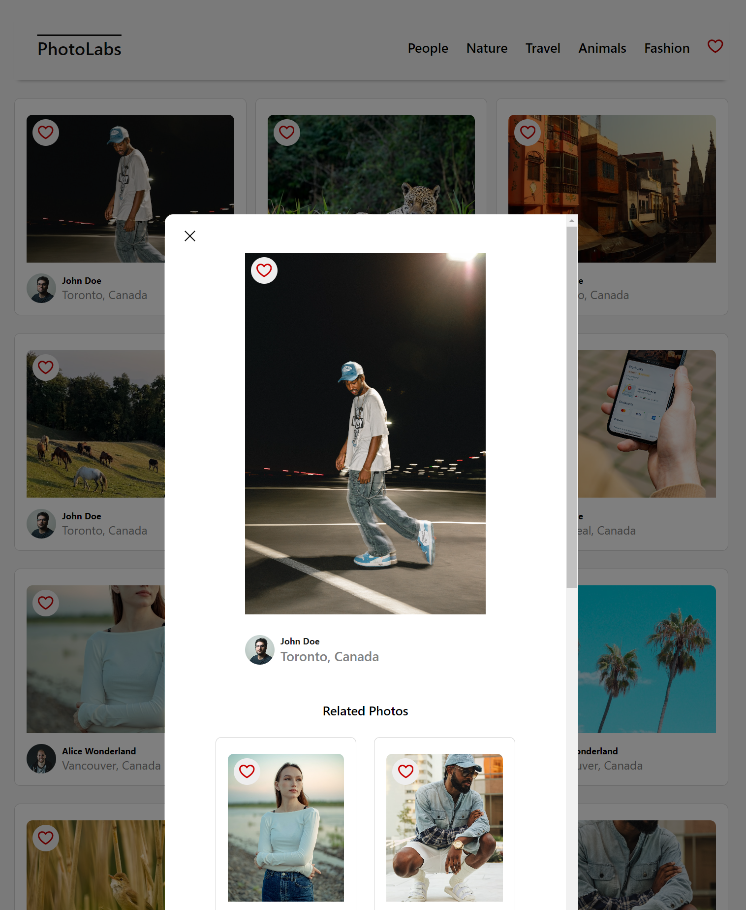

# Photolabs
A React application where you can view photos pulled from the API, see photos by categories and 'like' them to have a list of favourites. You cna open each photo in a sepaarte modal and see full-size photo and similar photos.

## Setup

Install dependencies with `npm install` in each respective `/frontend` and `/backend`.

## [Frontend] Running Webpack Development Server

```sh
cd frontend
npm start
```

## [Backend] Running Backend Servier

Read `backend/readme` for further setup details.

```sh
cd backend
npm start
```

## Run
You need to run both frontend and backend at the same time

## Screenshots




